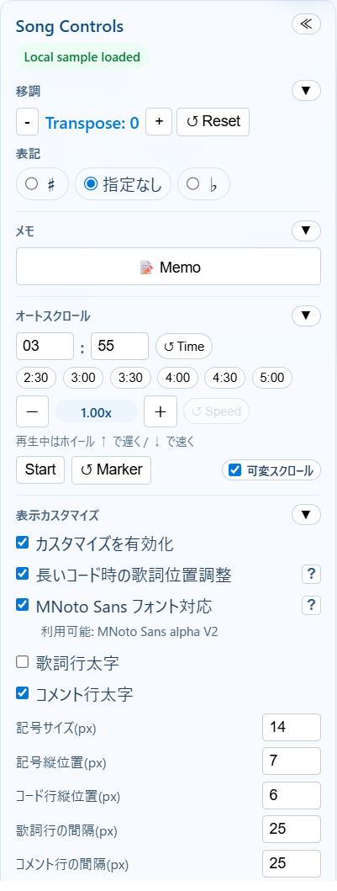
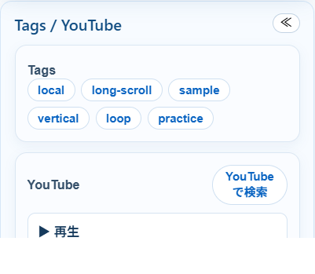

# ChordWiki Personal USER GUIDE

このファイルは、**ChordWiki Personal の使い方ガイド**です。  
システム構成や API 仕様は `ChordWiki-Architecture.md` を参照してください。

---

## 1. このガイドの対象

- **閲覧ユーザー**：曲を検索・表示・再生したい人
- **編集ユーザー (`editor`)**：曲の追加・更新・削除も行う人

> ログインには Microsoft アカウント認証を利用します。

---

## 2. 基本的な使い方

1. トップページを開く
2. ランキングまたは検索から曲を探す
3. 曲ページで譜面を表示する
4. 必要に応じて `Song Controls` や `Tags / YouTube` を使う

---

## 3. トップページの使い方

トップページでは、曲一覧の閲覧と検索を行えます。

### できること

- **ランキング表示**を見る
- **曲名 / アーティスト**で検索する
- **タグ**で検索する
- ページ送りで次の一覧を見る
- タイトルリンクやクリア操作でランキング表示へ戻る

### 検索のポイント

- `target=song`：曲名 / アーティストを検索
- `target=tag`：タグを検索
- 通常入力：部分一致
- `"完全一致"`：完全一致検索（曲名 / アーティスト検索時）

### 編集者だけ見える機能

- `新規追加` ボタン

---

## 4. 曲ページの使い方

曲ページでは、コード譜の表示・移調・オートスクロール・YouTube 連携を利用できます。

### 4.1 譜面表示

- ChordPro 形式のコード譜を表示します
- 画面幅が狭いときは、長い行を横スクロールで確認できます
- 曲を開くと、閲覧スコアがバックグラウンドで更新されます

### 4.2 Song Controls

`Song Controls` では、譜面表示や再生補助の設定を行います。



#### 主な機能

- **移調 / 表記**：`- / + / Reset` と `♯ / 指定なし / ♭`
- **メモ / 手書き**：個人用メモ追加、手書きツールの ON/OFF、太さ/色変更、任意削除、Undo
- **オートスクロール時間設定**：分・秒入力
- **時間プリセット**：`2:30 / 3:00 / 3:30 / 4:00 / 4:30 / 5:00`
- **速度微調整**：`－ / 現在倍率 / ＋ / ↺ Speed`（最大 `3.00x`）
- **表示カスタマイズ**：コードサイズ、行間などの見た目調整
- 各ブロックは **▼ / ▶** で縦に折りたたみ可能

#### メモ / 手書き の使い方

- `📝 Memo` で付箋メモを追加します
- 付箋は **タイトル / 本文 / 背景色** を持ち、位置はドラッグで調整できます
- 本文またはタイトルを **ダブルクリック / 編集アイコン** で編集できます
- コピーアイコンでは **本文のみ** をコピーします
- ピン留めすると **譜面に追従** し、ピンを外すと **画面固定** になります
- 付箋を小さくした場合、本文欄は内部スクロールで確認できます
- 手書きツールは曲を開いた時点では **右上で縮小表示・OFF** です。`draw` アイコンで展開して使います
- `push_pin` で新しい線の固定先を切り替え、`line_weight` と `palette` で **太さ / 色** を変更できます。選んだ内容は **このブラウザ内で記憶** されます
- 手書き線は `undo` で最後の 1 本を取り消せます。既存の線をクリックして選択し、`delete` または `Delete / Backspace` で **任意の 1 本** を削除できます
- `移調/表記`、`メモ / 手書き`、`オートスクロール`、`表示カスタマイズ` はそれぞれ **▼ / ▶** で折りたたみできます
- これらのデータは **このブラウザの localStorage のみに保存** されます

#### オートスクロールの使い方

1. 左側の `Start` / `End` マーカー位置を必要に応じて調整する
2. 再生したい時間を設定する
3. `Start` を押して再生する
4. 必要なら再生中に速度を微調整する（最大 `3.00x`）
5. `End` マーカーの上端がウィンドウ下端＋100pxまで到達したら自動停止する（100px先まで表示されたら停止）

#### 再生中の補助操作

- マウスホイール **↑**：少し遅くする
- マウスホイール **↓**：少し速くする
- 終端停止後、譜面をクリックすると `Start` 位置付近へ戻れます

---

### 4.3 Tags / YouTube

タグや YouTube 連携は、補助パネルから使えます。



#### Tags

- 曲に付いているタグを一覧表示します
- タグをクリックすると、そのタグで再検索します

#### YouTube

- 登録済み動画を `▶ 再生` で開けます
- 再生は右下のミニプレイヤーで同一タブ再生されます
- `YouTubeで検索` ボタンで、曲名 + アーティスト名を使った検索を別タブで開けます

---

## 5. 編集者向け機能 (`editor` ロール)

`editor` ロールのユーザーは、曲の作成・編集・削除ができます。

### 5.1 トップページから新規追加

- `新規追加` ボタンから登録画面へ進みます

### 5.2 曲ページから編集

- `Edit`：曲本体の編集ページへ移動
- `Delete`：曲を削除
- `Tags` / `YouTube` ヘッダーの `Edit`：簡易編集モーダルを開く

### 5.3 編集画面で入力する内容

- `title`：曲名
- `slug`：URL 用 ID
- `artist`：アーティスト名
- `tags`：**1 行 1 タグ**
- `youtube`：**1 行 1 動画**
- `chordPro`：譜面本文

#### `youtube` 入力例

```text
https://www.youtube.com/watch?v=mz5huG6uKUM
mz5huG6uKUM?t=42
mz5huG6uKUM&start=42
```

---

## 6. ローカル確認時の補足

ローカルプレビューでは、API が未起動でも一部 UI を確認できます。

- `.local` 配下のサンプルデータへ自動フォールバックする場合があります
- `/.auth/me` はローカルでは使えないため、権限表示は未ログイン相当になることがあります

---

## 7. よくある見方

### ランキングだけ見たい

- トップページを開く
- 検索中ならクリアして通常表示へ戻る

### タグで似た曲を見たい

- 曲ページでタグをクリックする

### 自動スクロールで練習したい

- 曲ページで時間を設定する
- `Start` を押す
- 必要ならホイールや `－ / ＋` で速度調整する

---

## 8. 関連ドキュメント

- 技術仕様・構成: `ChordWiki-Architecture.md`
- Azure セットアップ手順: `README.md`
